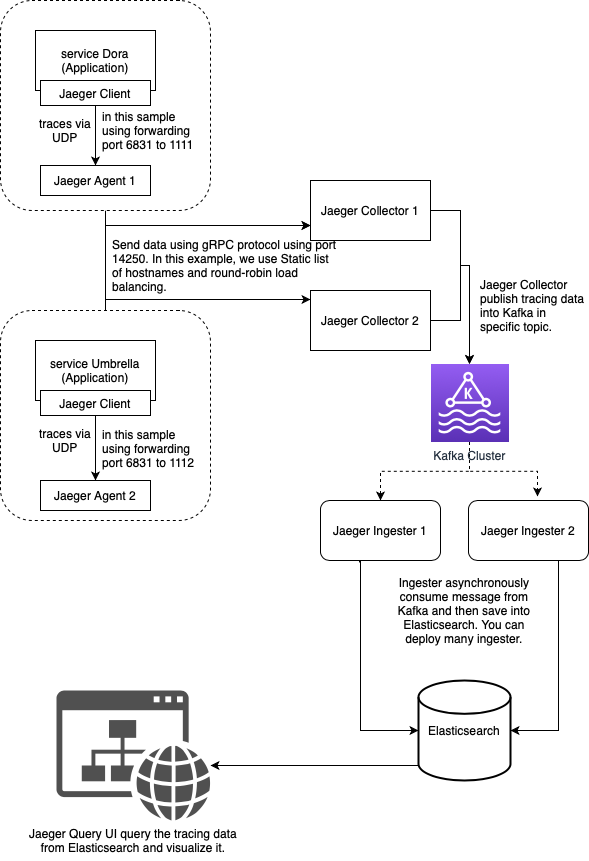

# Distributed Tracing

### Create network

    docker network create --driver=bridge my-net

### Prepare for Elasticsearch

    mkdir /data/elasticsearch -p
    chmod g+rwx /data/elasticsearch
    chgrp 0 /data/elasticsearch

    Set vm.max_map_count to at least 262144
        1. open file: /etc/sysctl.conf
        2. write and save: vm.max_map_count=262144
        3. run: sysctl -w vm.max_map_count=262144

### Move to working dir

    cd build/docker/production

### Validate and view the Compose file

    docker-compose -f docker-compose.jaeger-agent.yml config

### Start Elasticsearch first

    docker-compose -f docker-compose.elasticsearch.yml up -d

### Setup rollover for Elasticsearch

    1. Init
        ./docker.jaeger-es-rollover.init
    2. Add to crontab
        10,20,30,40,50 * * * * /usr/bin/chmod +x docker.jaeger-es-rollover.roll
        10,20,30,40,50 * * * * /usr/bin/bash docker.jaeger-es-rollover.roll
    3. Restart crontab
        service crond restart

### Start each Compose file

    docker-compose -f docker-compose.jaeger-agent.yml up -d
    docker-compose -f docker-compose.jaeger-collector.yml up -d
    docker-compose -f docker-compose.jaeger-ingester.yml up -d
    docker-compose -f docker-compose.jaeger-query.yml up -d
    docker-compose -f docker-compose.kibana.yml up -d
    docker-compose -f docker-compose.nginx.yml up -d

### View log

    docker logs -f -n100 miczone_distributed_tracing_jaeger-agent_1

### Load test

    cd test/docker
    docker run -i --rm --network=bridge loadimpact/k6:0.29.0 run --vus 50 --duration 1m - <load-test.js

### Optional command

    docker exec -it miczone_distributed_tracing_jaeger-agent_1 /bin/sh
